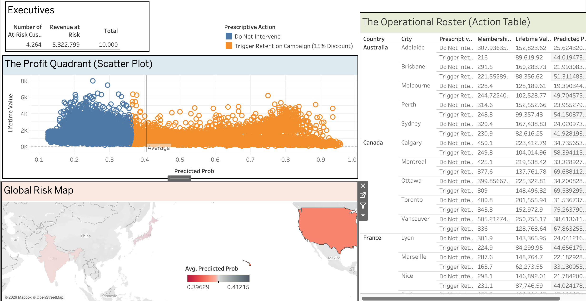

# Prescriptive Churn Analytics: Profit-Optimized Retention in E-Commerce 🛒📉


## 📌 Project Overview
Standard machine learning models for customer retention optimize for statistical accuracy (defaulting to a 0.50 probability decision threshold). This approach is financially flawed, as it treats the loss of a low-value customer identically to the loss of a high-value loyalist. 

This project transitions from **predictive analytics** (forecasting *who* will churn) to **prescriptive analytics** (dictating the *most profitable action*). By building a leakage-proof Scikit-Learn pipeline and a custom financial cost matrix, this repository identifies the exact predictive threshold that maximizes net enterprise retention profit.

## 💻 Interactive Dashboards

### Streamlit Executive Dashboard
Translates complex machine learning probabilities into a daily, prioritized action list for marketing teams.


### Tableau Strategic View
Visualizes macro-level revenue at risk and maps the "Profit Quadrant" to differentiate low-value discount hunters from high-value flight risks.


## 🚀 Key Features & Methodology
* **Leakage-Proof Pipeline:** Strict train/test partitioning prior to processing. Implements `StandardScaler` and K-Nearest Neighbors (`KNNImputer`) within a `ColumnTransformer` to handle missing data without data leakage.
* **Algorithmic Class Balancing:** Utilizes an optimized Random Forest Classifier (`class_weight='balanced'`) to detect flight risks in a highly imbalanced e-commerce dataset (~29% churn rate) without introducing synthetic data noise (e.g., SMOTE).
* **Custom Profit Simulator:** Rejects the default 0.50 decision threshold. A custom Python simulator weighs the **Cost of Intervention** (margin lost to discounts) against the **Cost of a False Negative** (Lifetime Value lost to churn) to find the absolute financial apex of the predictive model.

## 📊 Core Results
* **Predictive Performance:** Achieved an **ROC-AUC of 0.9248** and a minority-class **Recall of 0.79**.
* **Feature Importances:** Identified consecutive `Customer_Service_Calls` and digital `Cart_Abandonment_Rate` as the primary operational catalysts for platform abandonment.
* **Profit Optimization:** The financial simulator proved that lowering the decision threshold from `0.50` to **`0.28`** maximizes net campaign profit. Tolerating a higher rate of False Positives (wasting discounts on loyalists) successfully captures borderline, high-value flight risks that standard models ignore.

## 📂 Repository Structure
```text
├── assets/
│   ├── app dashboard.png                     # Streamlit app screenshot
│   └── dashboardd.png                        # Tableau dashboard screenshot
├── data/
├── notebooks/
└── README.md
